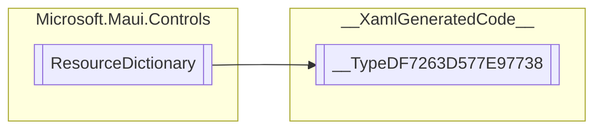

# __TypeDF7263D577E97738 `Public class`

## Diagram


## Details
### Inheritance
 - `ResourceDictionary`

### Constructors
#### __TypeDF7263D577E97738
```csharp
public __TypeDF7263D577E97738()
```

*Generated with* [*ModularDoc*](https://github.com/hailstorm75/ModularDoc)
