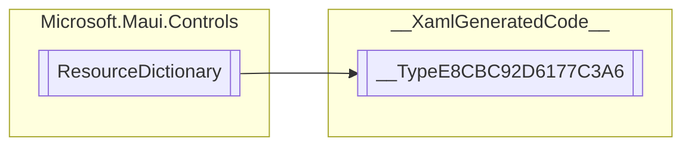

# __TypeE8CBC92D6177C3A6 `Public class`

## Diagram


## Details
### Inheritance
 - `ResourceDictionary`

### Constructors
#### __TypeE8CBC92D6177C3A6
```csharp
public __TypeE8CBC92D6177C3A6()
```

*Generated with* [*ModularDoc*](https://github.com/hailstorm75/ModularDoc)
