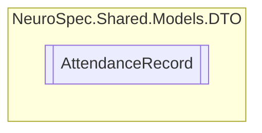

# AttendanceRecord `Public class`

## Diagram


## Members
### Properties
#### Public  properties
| Type | Name | Methods |
| --- | --- | --- |
| `string` | [`Id`](#id) | `get, set` |
| `bool` | [`IsPresent`](#ispresent) | `get, set` |
| `int` | [`RecordID`](#recordid) | `get, set` |
| `DateTime` | [`TimeStamp`](#timestamp) | `get, set` |
| `int` | [`UserID`](#userid) | `get, set` |

## Details
### Constructors
#### AttendanceRecord
```csharp
public AttendanceRecord()
```

### Properties
#### Id
```csharp
public string Id { get; set; }
```

#### RecordID
```csharp
public int RecordID { get; set; }
```

#### TimeStamp
```csharp
public DateTime TimeStamp { get; set; }
```

#### UserID
```csharp
public int UserID { get; set; }
```

#### IsPresent
```csharp
public bool IsPresent { get; set; }
```

*Generated with* [*ModularDoc*](https://github.com/hailstorm75/ModularDoc)
