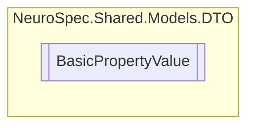

# BasicPropertyValue `Public class`

## Diagram


## Members
### Properties
#### Public  properties
| Type | Name | Methods |
| --- | --- | --- |
| `string` | [`Pred`](#pred) | `get, set` |
| `string` | [`Val`](#val) | `get, set` |

## Details
### Constructors
#### BasicPropertyValue [1/2]
[*Source code*](https://github.com///blob//NeuroSpec.Shared/Models/DTO/OntologyTerm.cs#L135)
```csharp
public BasicPropertyValue()
```

#### BasicPropertyValue [2/2]
[*Source code*](https://github.com///blob//NeuroSpec.Shared/Models/DTO/OntologyTerm.cs#L141)
```csharp
public BasicPropertyValue(string pred, string val)
```
##### Arguments
| Type | Name | Description |
| --- | --- | --- |
| `string` | pred |   |
| `string` | val |   |

### Properties
#### Pred
```csharp
public string Pred { get; set; }
```

#### Val
```csharp
public string Val { get; set; }
```

*Generated with* [*ModularDoc*](https://github.com/hailstorm75/ModularDoc)
