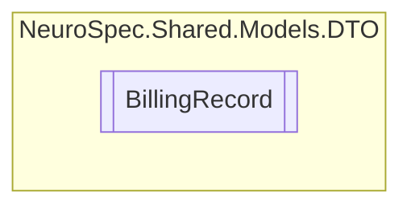

# BillingRecord `Public class`

## Diagram


## Members
### Properties
#### Public  properties
| Type | Name | Methods |
| --- | --- | --- |
| `double` | [`BillingAmount`](#billingamount) | `get, set` |
| `int` | [`BillingID`](#billingid) | `get, set` |
| `string` | [`Id`](#id) | `get, set` |
| `int` | [`PatientID`](#patientid) | `get, set` |
| `int` | [`TreatmentPlanID`](#treatmentplanid) | `get, set` |

## Details
### Constructors
#### BillingRecord
```csharp
public BillingRecord()
```

### Properties
#### Id
```csharp
public string Id { get; set; }
```

#### BillingID
```csharp
public int BillingID { get; set; }
```

#### BillingAmount
```csharp
public double BillingAmount { get; set; }
```

#### TreatmentPlanID
```csharp
public int TreatmentPlanID { get; set; }
```

#### PatientID
```csharp
public int PatientID { get; set; }
```

*Generated with* [*ModularDoc*](https://github.com/hailstorm75/ModularDoc)
