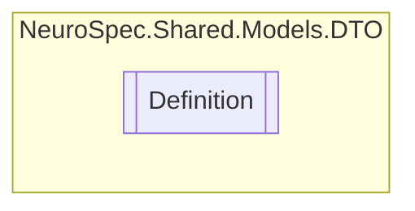

# Definition `Public class`

## Diagram


## Members
### Properties
#### Public  properties
| Type | Name | Methods |
| --- | --- | --- |
| `string` | [`Val`](#val) | `get, set` |
| `List`&lt;`string`&gt; | [`Xrefs`](#xrefs) | `get, set` |

## Details
### Constructors
#### Definition [1/2]
[*Source code*](https://github.com///blob//NeuroSpec.Shared/Models/DTO/OntologyTerm.cs#L79)
```csharp
public Definition()
```

#### Definition [2/2]
[*Source code*](https://github.com///blob//NeuroSpec.Shared/Models/DTO/OntologyTerm.cs#L85)
```csharp
public Definition(string val, List<string> xrefs)
```
##### Arguments
| Type | Name | Description |
| --- | --- | --- |
| `string` | val |   |
| `List`&lt;`string`&gt; | xrefs |   |

### Properties
#### Val
```csharp
public string Val { get; set; }
```

#### Xrefs
```csharp
public List<string> Xrefs { get; set; }
```

*Generated with* [*ModularDoc*](https://github.com/hailstorm75/ModularDoc)
