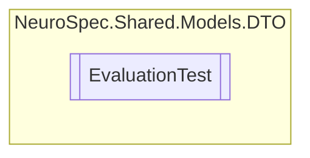

# EvaluationTest `Public class`

## Diagram


## Members
### Properties
#### Public  properties
| Type | Name | Methods |
| --- | --- | --- |
| `string` | [`Id`](#id) | `get, set` |
| `string` | [`TestDescription`](#testdescription) | `get, set` |
| `int` | [`TestID`](#testid) | `get, set` |
| `string` | [`TestName`](#testname) | `get, set` |

### Methods
#### Public  methods
| Returns | Name |
| --- | --- |
| `string` | [`ToString`](#tostring)() |

## Details
### Constructors
#### EvaluationTest
```csharp
public EvaluationTest()
```

### Methods
#### ToString
[*Source code*](https://github.com///blob//NeuroSpec.Shared/Models/DTO/EvaluationTest.cs#L24)
```csharp
public override string ToString()
```

### Properties
#### Id
```csharp
public string Id { get; set; }
```

#### TestID
```csharp
public int TestID { get; set; }
```

#### TestName
```csharp
public string TestName { get; set; }
```

#### TestDescription
```csharp
public string TestDescription { get; set; }
```

*Generated with* [*ModularDoc*](https://github.com/hailstorm75/ModularDoc)
