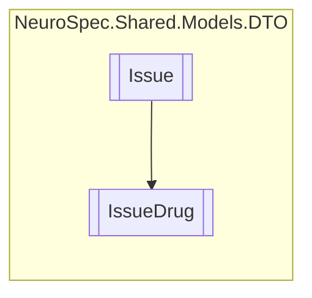

# IssueDrug `Public class`

## Diagram


## Members
### Properties
#### Public  properties
| Type | Name | Methods |
| --- | --- | --- |
| `string` | [`Dosage`](#dosage) | `get, set` |
| `int` | [`DrugID`](#drugid) | `get, set` |
| `string` | [`Duration`](#duration) | `get, set` |
| `string` | [`Frequency`](#frequency) | `get, set` |
| `int` | [`Quantity`](#quantity) | `get, set` |

## Details
### Inheritance
 - [
`Issue`
](./Issue.md)

### Constructors
#### IssueDrug
```csharp
public IssueDrug()
```

### Properties
#### DrugID
```csharp
public int DrugID { get; set; }
```

#### Quantity
```csharp
public int Quantity { get; set; }
```

#### Dosage
```csharp
public string Dosage { get; set; }
```

#### Frequency
```csharp
public string Frequency { get; set; }
```

#### Duration
```csharp
public string Duration { get; set; }
```

*Generated with* [*ModularDoc*](https://github.com/hailstorm75/ModularDoc)
