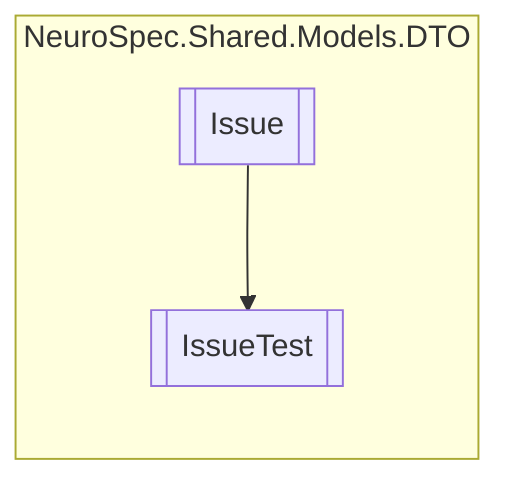

# IssueTest `Public class`

## Description
Could be a medical test, a lab test, a diagnostic test or a medical imaging, visual scan (MRI, X-Ray, CT).

## Diagram


## Members
### Properties
#### Public  properties
| Type | Name | Methods |
| --- | --- | --- |
| `int` | [`TestID`](#testid) | `get, set` |
| `string` | [`TestName`](#testname) | `get, set` |
| `string` | [`TestRange`](#testrange) | `get, set` |
| `string` | [`TestUnit`](#testunit) | `get, set` |

## Details
### Summary
Could be a medical test, a lab test, a diagnostic test or a medical imaging, visual scan (MRI, X-Ray, CT).

### Inheritance
 - [
`Issue`
](./Issue.md)

### Constructors
#### IssueTest
```csharp
public IssueTest()
```

### Properties
#### TestID
```csharp
public int TestID { get; set; }
```

#### TestName
```csharp
public string TestName { get; set; }
```

#### TestUnit
```csharp
public string TestUnit { get; set; }
```

#### TestRange
```csharp
public string TestRange { get; set; }
```

*Generated with* [*ModularDoc*](https://github.com/hailstorm75/ModularDoc)
