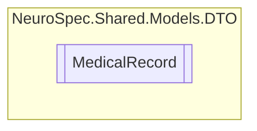

# MedicalRecord `Public class`

## Description
Refrences DiagonsticReport in FHIR

## Diagram


## Members
### Properties
#### Public  properties
| Type | Name | Methods |
| --- | --- | --- |
| `string` | [`DoctorNotes`](#doctornotes) | `get, set` |
| `string` | [`Id`](#id) | `get, set` |
| `int` | [`PatientID`](#patientid) | `get, set` |
| `int` | [`RecordID`](#recordid) | `get, set` |
| `string` | [`Report`](#report) | `get, set` |
| `DateTime` | [`TimeStamp`](#timestamp) | `get, set` |
| `string` | [`Type`](#type) | `get, set` |
| `List`&lt;[`Attachment`](./Attachment.md)&gt; | [`VisualAttachments`](#visualattachments) | `get, set` |

## Details
### Summary
Refrences DiagonsticReport in FHIR

### Constructors
#### MedicalRecord
```csharp
public MedicalRecord()
```

### Properties
#### Id
```csharp
public string Id { get; set; }
```

#### RecordID
```csharp
public int RecordID { get; set; }
```

#### Type
```csharp
public string Type { get; set; }
```

#### TimeStamp
```csharp
public DateTime TimeStamp { get; set; }
```

#### Report
```csharp
public string Report { get; set; }
```

#### VisualAttachments
```csharp
public List<Attachment> VisualAttachments { get; set; }
```

#### PatientID
```csharp
public int PatientID { get; set; }
```

#### DoctorNotes
```csharp
public string DoctorNotes { get; set; }
```

*Generated with* [*ModularDoc*](https://github.com/hailstorm75/ModularDoc)
