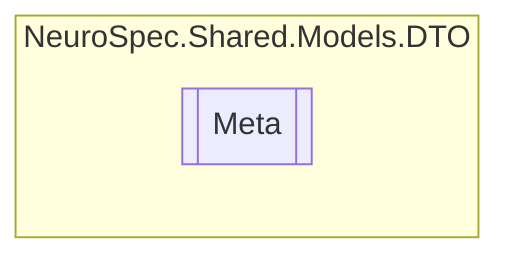

# Meta `Public class`

## Diagram


## Members
### Properties
#### Public  properties
| Type | Name | Methods |
| --- | --- | --- |
| `List`&lt;[`BasicPropertyValue`](./BasicPropertyValue.md)&gt; | [`BasicPropertyValues`](#basicpropertyvalues) | `get, set` |
| [`Definition`](./Definition.md) | [`Definition`](#definition) | `get, set` |
| `List`&lt;`string`&gt; | [`Subsets`](#subsets) | `get, set` |
| `List`&lt;[`Synonym`](./Synonym.md)&gt; | [`Synonyms`](#synonyms) | `get, set` |
| `List`&lt;[`Xref`](./Xref.md)&gt; | [`Xrefs`](#xrefs) | `get, set` |

## Details
### Constructors
#### Meta [1/2]
[*Source code*](https://github.com///blob//NeuroSpec.Shared/Models/DTO/OntologyTerm.cs#L53)
```csharp
public Meta()
```

#### Meta [2/2]
[*Source code*](https://github.com///blob//NeuroSpec.Shared/Models/DTO/OntologyTerm.cs#L62)
```csharp
public Meta(Definition definition, List<string> subsets, List<Synonym> synonyms, List<Xref> xrefs, List<BasicPropertyValue> basicPropertyValues)
```
##### Arguments
| Type | Name | Description |
| --- | --- | --- |
| [`Definition`](./Definition.md) | definition |   |
| `List`&lt;`string`&gt; | subsets |   |
| `List`&lt;[`Synonym`](./Synonym.md)&gt; | synonyms |   |
| `List`&lt;[`Xref`](./Xref.md)&gt; | xrefs |   |
| `List`&lt;[`BasicPropertyValue`](./BasicPropertyValue.md)&gt; | basicPropertyValues |   |

### Properties
#### Definition
```csharp
public Definition Definition { get; set; }
```

#### Subsets
```csharp
public List<string> Subsets { get; set; }
```

#### Synonyms
```csharp
public List<Synonym> Synonyms { get; set; }
```

#### Xrefs
```csharp
public List<Xref> Xrefs { get; set; }
```

#### BasicPropertyValues
```csharp
public List<BasicPropertyValue> BasicPropertyValues { get; set; }
```

*Generated with* [*ModularDoc*](https://github.com/hailstorm75/ModularDoc)
