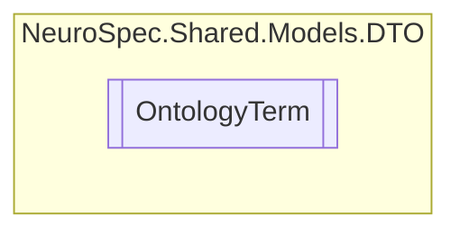

# OntologyTerm `Public class`

## Diagram


## Members
### Properties
#### Public  properties
| Type | Name | Methods |
| --- | --- | --- |
| `string` | [`Id`](#id) | `get, set` |
| `string` | [`Lbl`](#lbl) | `get, set` |
| [`Meta`](./Meta.md) | [`Meta`](#meta) | `get, set` |
| `string` | [`Type`](#type) | `get, set` |
| `string` | [`_Id`](#id) | `get, set` |

## Details
### Constructors
#### OntologyTerm [1/2]
[*Source code*](https://github.com///blob//NeuroSpec.Shared/Models/DTO/OntologyTerm.cs#L22)
```csharp
public OntologyTerm()
```

#### OntologyTerm [2/2]
[*Source code*](https://github.com///blob//NeuroSpec.Shared/Models/DTO/OntologyTerm.cs#L30)
```csharp
public OntologyTerm(string id, string lbl, string type, Meta meta)
```
##### Arguments
| Type | Name | Description |
| --- | --- | --- |
| `string` | id |   |
| `string` | lbl |   |
| `string` | type |   |
| [`Meta`](./Meta.md) | meta |   |

### Properties
#### _Id
```csharp
public string _Id { get; set; }
```

#### Id
```csharp
public string Id { get; set; }
```

#### Lbl
```csharp
public string Lbl { get; set; }
```

#### Type
```csharp
public string Type { get; set; }
```

#### Meta
```csharp
public Meta Meta { get; set; }
```

*Generated with* [*ModularDoc*](https://github.com/hailstorm75/ModularDoc)
