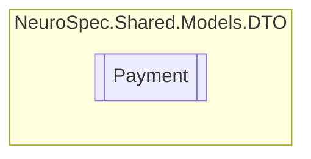

# Payment `Public class`

## Diagram


## Members
### Properties
#### Public  properties
| Type | Name | Methods |
| --- | --- | --- |
| `double` | [`Amount`](#amount) | `get, set` |
| `int` | [`DoctorID`](#doctorid) | `get, set` |
| `string` | [`Id`](#id) | `get, set` |
| `int` | [`PatientID`](#patientid) | `get, set` |
| `int` | [`PaymentID`](#paymentid) | `get, set` |
| `DateTime` | [`TimeStamp`](#timestamp) | `get, set` |

## Details
### Constructors
#### Payment
```csharp
public Payment()
```

### Properties
#### Id
```csharp
public string Id { get; set; }
```

#### PaymentID
```csharp
public int PaymentID { get; set; }
```

#### Amount
```csharp
public double Amount { get; set; }
```

#### TimeStamp
```csharp
public DateTime TimeStamp { get; set; }
```

#### DoctorID
```csharp
public int DoctorID { get; set; }
```

#### PatientID
```csharp
public int PatientID { get; set; }
```

*Generated with* [*ModularDoc*](https://github.com/hailstorm75/ModularDoc)
