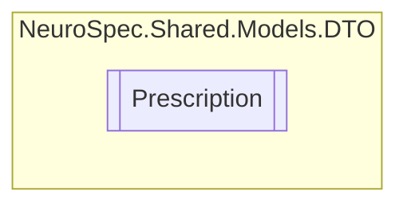

# Prescription `Public class`

## Diagram


## Members
### Properties
#### Public  properties
| Type | Name | Methods |
| --- | --- | --- |
| `int` | [`DoctorID`](#doctorid) | `get, set` |
| `string` | [`Id`](#id) | `get, set` |
| `int` | [`PatientID`](#patientid) | `get, set` |
| `int` | [`PrescriptionID`](#prescriptionid) | `get, set` |
| `DateTime` | [`TimeStamp`](#timestamp) | `get, set` |
| `int` | [`VisitID`](#visitid) | `get, set` |

## Details
### Constructors
#### Prescription
```csharp
public Prescription()
```

### Properties
#### Id
```csharp
public string Id { get; set; }
```

#### PrescriptionID
```csharp
public int PrescriptionID { get; set; }
```

#### TimeStamp
```csharp
public DateTime TimeStamp { get; set; }
```

#### PatientID
```csharp
public int PatientID { get; set; }
```

#### DoctorID
```csharp
public int DoctorID { get; set; }
```

#### VisitID
```csharp
public int VisitID { get; set; }
```

*Generated with* [*ModularDoc*](https://github.com/hailstorm75/ModularDoc)
