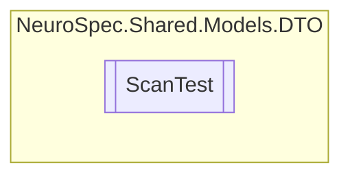

# ScanTest `Public class`

## Diagram


## Members
### Properties
#### Public  properties
| Type | Name | Methods |
| --- | --- | --- |
| `string` | [`Id`](#id) | `get, set` |
| `string` | [`Notes`](#notes) | `get, set` |
| `string` | [`RecommendedLab`](#recommendedlab) | `get, set` |
| `int` | [`ScanTestID`](#scantestid) | `get, set` |
| `string` | [`ScanTestName`](#scantestname) | `get, set` |

### Methods
#### Public  methods
| Returns | Name |
| --- | --- |
| `string` | [`ToString`](#tostring)() |

## Details
### Constructors
#### ScanTest
```csharp
public ScanTest()
```

### Methods
#### ToString
[*Source code*](https://github.com///blob//NeuroSpec.Shared/Models/DTO/ScanTest.cs#L19)
```csharp
public override string ToString()
```

### Properties
#### Id
```csharp
public string Id { get; set; }
```

#### ScanTestID
```csharp
public int ScanTestID { get; set; }
```

#### ScanTestName
```csharp
public string ScanTestName { get; set; }
```

#### RecommendedLab
```csharp
public string RecommendedLab { get; set; }
```

#### Notes
```csharp
public string Notes { get; set; }
```

*Generated with* [*ModularDoc*](https://github.com/hailstorm75/ModularDoc)
