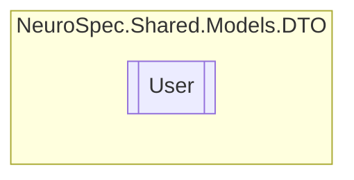

# User `Public class`

## Diagram


## Members
### Properties
#### Public  properties
| Type | Name | Methods |
| --- | --- | --- |
| `string` | [`Address`](#address) | `get, set` |
| `DateTime` | [`Birthdate`](#birthdate) | `get, set` |
| `string` | [`Email`](#email) | `get, set` |
| `string` | [`FirstName`](#firstname) | `get, set` |
| `string` | [`FullName`](#fullname) | `get` |
| `bool` | [`Gender`](#gender) | `get, set` |
| `DateTime` | [`HireDate`](#hiredate) | `get, set` |
| `string` | [`Id`](#id) | `get, set` |
| `string` | [`LastName`](#lastname) | `get, set` |
| `string` | [`NationalID`](#nationalid) | `get, set` |
| `string` | [`Password`](#password) | `get, set` |
| `string` | [`PhoneNumber`](#phonenumber) | `get, set` |
| `int` | [`UserID`](#userid) | `get, set` |
| `bool` | [`isAdmin`](#isadmin) | `get` |
| `bool` | [`isEmployee`](#isemployee) | `get` |
| `bool` | [`isReciptionist`](#isreciptionist) | `get` |

### Methods
#### Public  methods
| Returns | Name |
| --- | --- |
| `string` | [`ToString`](#tostring)() |

## Details
### Constructors
#### User
```csharp
public User()
```

### Methods
#### ToString
[*Source code*](https://github.com///blob//NeuroSpec.Shared/Models/DTO/User.cs#L31)
```csharp
public override string ToString()
```

### Properties
#### Id
```csharp
public string Id { get; set; }
```

#### UserID
```csharp
public int UserID { get; set; }
```

#### FirstName
```csharp
public string FirstName { get; set; }
```

#### LastName
```csharp
public string LastName { get; set; }
```

#### Gender
```csharp
public bool Gender { get; set; }
```

#### HireDate
```csharp
public DateTime HireDate { get; set; }
```

#### Birthdate
```csharp
public DateTime Birthdate { get; set; }
```

#### Address
```csharp
public string Address { get; set; }
```

#### PhoneNumber
```csharp
public string PhoneNumber { get; set; }
```

#### Email
```csharp
public string Email { get; set; }
```

#### NationalID
```csharp
public string NationalID { get; set; }
```

#### Password
```csharp
public string Password { get; set; }
```

#### FullName
```csharp
public string FullName { get; }
```

#### isReciptionist
```csharp
public bool isReciptionist { get; }
```

#### isEmployee
```csharp
public bool isEmployee { get; }
```

#### isAdmin
```csharp
public bool isAdmin { get; }
```

*Generated with* [*ModularDoc*](https://github.com/hailstorm75/ModularDoc)
