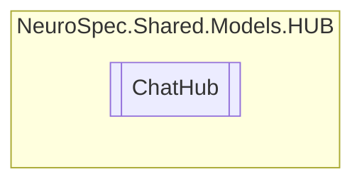

# ChatHub `Public class`

## Diagram


## Members
### Methods
#### Public  methods
| Returns | Name |
| --- | --- |
| `Task` | [`SendMessage`](#sendmessage)(`string` userName, `string` message) |

## Details
### Constructors
#### ChatHub
```csharp
public ChatHub()
```

### Methods
#### SendMessage
```csharp
public async Task SendMessage(string userName, string message)
```
##### Arguments
| Type | Name | Description |
| --- | --- | --- |
| `string` | userName |   |
| `string` | message |   |

*Generated with* [*ModularDoc*](https://github.com/hailstorm75/ModularDoc)
