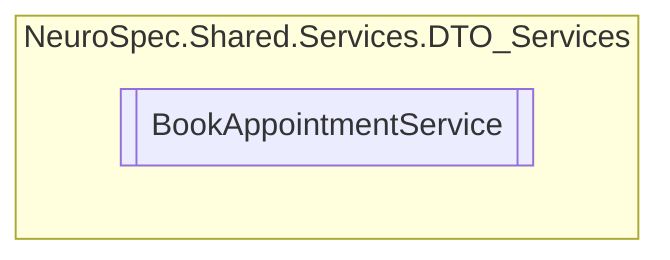

# BookAppointmentService `Public class`

## Diagram


## Members
### Methods
#### Public  methods
| Returns | Name |
| --- | --- |
| `Task` | [`DeleteBookAppointmentRequestAsync`](#deletebookappointmentrequestasync)(`int` bookAppointmentRequestID) |
| `Task`&lt;[`BookAppointmentRequest`](../../models/dto/BookAppointmentRequest.md)&gt; | [`GetBookAppointmentRequestByIDAsync`](#getbookappointmentrequestbyidasync)(`int` bookAppointmentRequestID) |
| `Task`&lt;`IEnumerable`&lt;[`BookAppointmentRequest`](../../models/dto/BookAppointmentRequest.md)&gt;&gt; | [`GetBookAppointmentRequestsByPatientIDAsync`](#getbookappointmentrequestsbypatientidasync)(`int` patientID) |
| `Task`&lt;`IEnumerable`&lt;[`BookAppointmentRequest`](../../models/dto/BookAppointmentRequest.md)&gt;&gt; | [`GetNotConfirmedBookAppointmentRequestsAsync`](#getnotconfirmedbookappointmentrequestsasync)() |
| `Task`&lt;[`BookAppointmentRequest`](../../models/dto/BookAppointmentRequest.md)&gt; | [`InsertBookAppointmentRequestAsync`](#insertbookappointmentrequestasync)([`BookAppointmentRequest`](../../models/dto/BookAppointmentRequest.md) bookAppointmentRequest) |
| `Task` | [`MarkAsConfirmedAsync`](#markasconfirmedasync)(`int` bookAppointmentRequestID) |
| `Task` | [`UpdateBookAppointmentRequestAsync`](#updatebookappointmentrequestasync)(`int` bookAppointmentRequestID, [`BookAppointmentRequest`](../../models/dto/BookAppointmentRequest.md) bookAppointmentRequest) |

## Details
### Constructors
#### BookAppointmentService
[*Source code*](https://github.com///blob//NeuroSpec.Shared/Services/DTO_Services/BookAppointmentService.cs#L13)
```csharp
public BookAppointmentService()
```

### Methods
#### InsertBookAppointmentRequestAsync
```csharp
public async Task<BookAppointmentRequest> InsertBookAppointmentRequestAsync(BookAppointmentRequest bookAppointmentRequest)
```
##### Arguments
| Type | Name | Description |
| --- | --- | --- |
| [`BookAppointmentRequest`](../../models/dto/BookAppointmentRequest.md) | bookAppointmentRequest |   |

#### GetBookAppointmentRequestByIDAsync
```csharp
public async Task<BookAppointmentRequest> GetBookAppointmentRequestByIDAsync(int bookAppointmentRequestID)
```
##### Arguments
| Type | Name | Description |
| --- | --- | --- |
| `int` | bookAppointmentRequestID |   |

#### UpdateBookAppointmentRequestAsync
```csharp
public async Task UpdateBookAppointmentRequestAsync(int bookAppointmentRequestID, BookAppointmentRequest bookAppointmentRequest)
```
##### Arguments
| Type | Name | Description |
| --- | --- | --- |
| `int` | bookAppointmentRequestID |   |
| [`BookAppointmentRequest`](../../models/dto/BookAppointmentRequest.md) | bookAppointmentRequest |   |

#### MarkAsConfirmedAsync
```csharp
public async Task MarkAsConfirmedAsync(int bookAppointmentRequestID)
```
##### Arguments
| Type | Name | Description |
| --- | --- | --- |
| `int` | bookAppointmentRequestID |   |

#### DeleteBookAppointmentRequestAsync
```csharp
public async Task DeleteBookAppointmentRequestAsync(int bookAppointmentRequestID)
```
##### Arguments
| Type | Name | Description |
| --- | --- | --- |
| `int` | bookAppointmentRequestID |   |

#### GetNotConfirmedBookAppointmentRequestsAsync
```csharp
public async Task<IEnumerable<BookAppointmentRequest>> GetNotConfirmedBookAppointmentRequestsAsync()
```

#### GetBookAppointmentRequestsByPatientIDAsync
```csharp
public async Task<IEnumerable<BookAppointmentRequest>> GetBookAppointmentRequestsByPatientIDAsync(int patientID)
```
##### Arguments
| Type | Name | Description |
| --- | --- | --- |
| `int` | patientID |   |

*Generated with* [*ModularDoc*](https://github.com/hailstorm75/ModularDoc)
