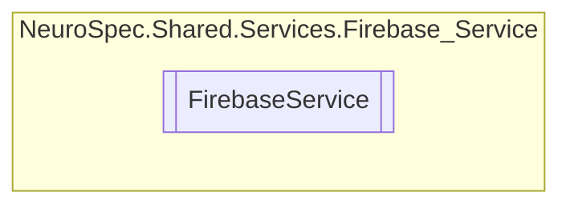

# FirebaseService `Public class`

## Diagram


## Members
### Methods
#### Public  methods
| Returns | Name |
| --- | --- |
| `Task`&lt;`string`&gt; | [`UploadFile`](#uploadfile)(`Stream` _fileStream) |
| `Task`&lt;`string`&gt; | [`UploadProfilePicture`](#uploadprofilepicture)(`Stream` _fileStream) |

## Details
### Constructors
#### FirebaseService
[*Source code*](https://github.com///blob//NeuroSpec.Shared/Services/Firebase_Service/FirebaseService.cs#L10)
```csharp
public FirebaseService()
```

### Methods
#### UploadFile
```csharp
public async Task<string> UploadFile(Stream _fileStream)
```
##### Arguments
| Type | Name | Description |
| --- | --- | --- |
| `Stream` | _fileStream |   |

#### UploadProfilePicture
```csharp
public async Task<string> UploadProfilePicture(Stream _fileStream)
```
##### Arguments
| Type | Name | Description |
| --- | --- | --- |
| `Stream` | _fileStream |   |

*Generated with* [*ModularDoc*](https://github.com/hailstorm75/ModularDoc)
