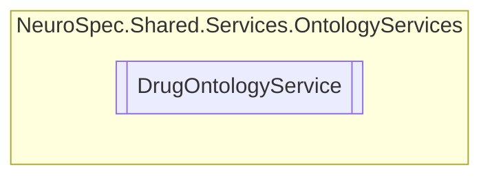

# DrugOntologyService `Public class`

## Diagram


## Members
### Methods
#### Public  methods
| Returns | Name |
| --- | --- |
| `Task`&lt;`List`&lt;[`DrugOntology`](../../models/ontology/DrugOntology.md)&gt;&gt; | [`SearchDrugOntologyAsync`](#searchdrugontologyasync)(`string` drugName) |

## Details
### Constructors
#### DrugOntologyService
[*Source code*](https://github.com///blob//NeuroSpec.Shared/Services/OntologyService/DrugOntologyService.cs#L14)
```csharp
public DrugOntologyService()
```

### Methods
#### SearchDrugOntologyAsync
```csharp
public async Task<List<DrugOntology>> SearchDrugOntologyAsync(string drugName)
```
##### Arguments
| Type | Name | Description |
| --- | --- | --- |
| `string` | drugName |   |

*Generated with* [*ModularDoc*](https://github.com/hailstorm75/ModularDoc)
