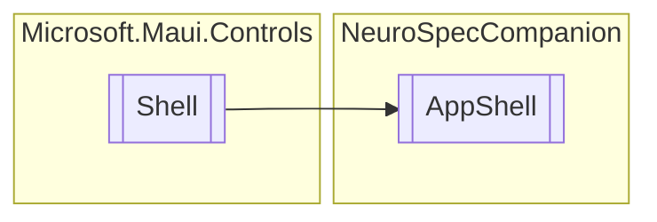

# AppShell `Public class`

## Diagram


## Details
### Inheritance
 - `Shell`

### Constructors
#### AppShell
[*Source code*](https://github.com///blob//NeuroSpecCompanion/AppShell.xaml.cs#L8)
```csharp
public AppShell()
```

*Generated with* [*ModularDoc*](https://github.com/hailstorm75/ModularDoc)
