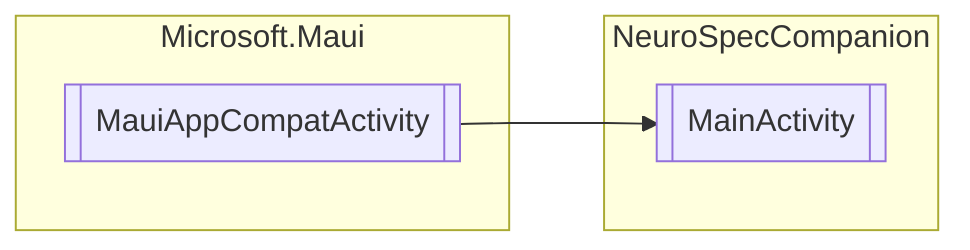

# MainActivity `Public class`

## Diagram


## Details
### Inheritance
 - `MauiAppCompatActivity`

### Constructors
#### MainActivity
```csharp
public MainActivity()
```

*Generated with* [*ModularDoc*](https://github.com/hailstorm75/ModularDoc)
