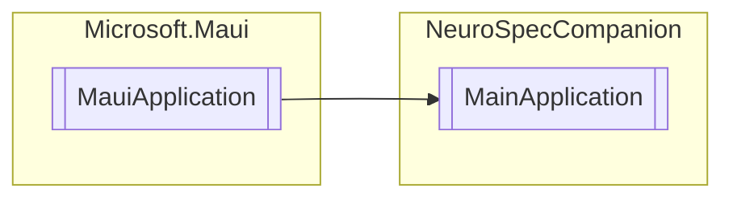

# MainApplication `Public class`

## Diagram


## Members
### Methods
#### Protected  methods
| Returns | Name |
| --- | --- |
| `MauiApp` | [`CreateMauiApp`](#createmauiapp)() |

## Details
### Inheritance
 - `MauiApplication`

### Constructors
#### MainApplication
[*Source code*](https://github.com///blob//NeuroSpecCompanion/Platforms/Android/MainApplication.cs#L10)
```csharp
public MainApplication(IntPtr handle, JniHandleOwnership ownership)
```
##### Arguments
| Type | Name | Description |
| --- | --- | --- |
| `IntPtr` | handle |   |
| `JniHandleOwnership` | ownership |   |

### Methods
#### CreateMauiApp
[*Source code*](https://github.com///blob//NeuroSpecCompanion/Platforms/Android/MainApplication.cs#L14)
```csharp
protected override MauiApp CreateMauiApp()
```

*Generated with* [*ModularDoc*](https://github.com/hailstorm75/ModularDoc)
