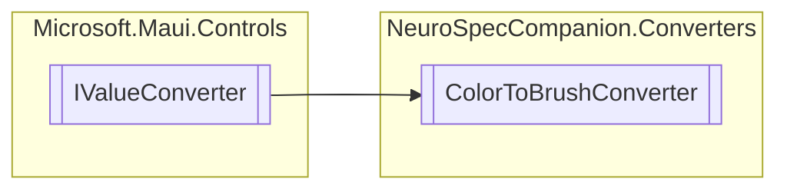

# ColorToBrushConverter `Public class`

## Diagram


## Members
### Methods
#### Public  methods
| Returns | Name |
| --- | --- |
| `object` | [`Convert`](#convert)(`object` value, `Type` targetType, `object` parameter, `CultureInfo` culture) |
| `object` | [`ConvertBack`](#convertback)(`object` value, `Type` targetType, `object` parameter, `CultureInfo` culture) |

## Details
### Inheritance
 - `IValueConverter`

### Constructors
#### ColorToBrushConverter
```csharp
public ColorToBrushConverter()
```

### Methods
#### Convert
[*Source code*](https://github.com///blob//NeuroSpecCompanion/Converters/ColorToBrushConverter.cs#L13)
```csharp
public virtual object Convert(object value, Type targetType, object parameter, CultureInfo culture)
```
##### Arguments
| Type | Name | Description |
| --- | --- | --- |
| `object` | value |   |
| `Type` | targetType |   |
| `object` | parameter |   |
| `CultureInfo` | culture |   |

#### ConvertBack
[*Source code*](https://github.com///blob//NeuroSpecCompanion/Converters/ColorToBrushConverter.cs#L21)
```csharp
public virtual object ConvertBack(object value, Type targetType, object parameter, CultureInfo culture)
```
##### Arguments
| Type | Name | Description |
| --- | --- | --- |
| `object` | value |   |
| `Type` | targetType |   |
| `object` | parameter |   |
| `CultureInfo` | culture |   |

*Generated with* [*ModularDoc*](https://github.com/hailstorm75/ModularDoc)
