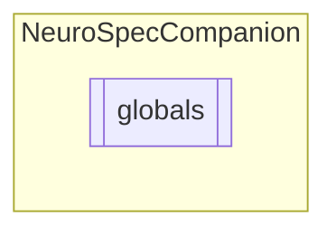

# globals `Public class`

## Diagram


## Members
### Methods
#### Public Static methods
| Returns | Name |
| --- | --- |
| `string` | [`FormatTimeMinSeconds`](#formattimeminseconds)(`int` min, `int` sec) |

## Details
### Constructors
#### globals
```csharp
public globals()
```

### Methods
#### FormatTimeMinSeconds
[*Source code*](https://github.com///blob//NeuroSpecCompanion/globals.cs#L13)
```csharp
public static string FormatTimeMinSeconds(int min, int sec)
```
##### Arguments
| Type | Name | Description |
| --- | --- | --- |
| `int` | min |   |
| `int` | sec |   |

*Generated with* [*ModularDoc*](https://github.com/hailstorm75/ModularDoc)
