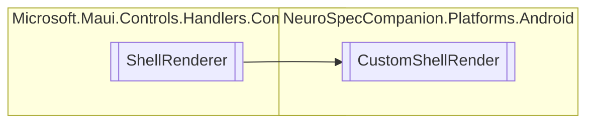

# CustomShellRender `Public class`

## Diagram


## Members
### Methods
#### Protected  methods
| Returns | Name |
| --- | --- |
| `IShellBottomNavViewAppearanceTracker` | [`CreateBottomNavViewAppearanceTracker`](#createbottomnavviewappearancetracker)(`ShellItem` shellItem) |

## Details
### Inheritance
 - `ShellRenderer`

### Constructors
#### CustomShellRender
[*Source code*](https://github.com///blob//NeuroSpecCompanion/Platforms/Android/CustomShellRender.cs#L17)
```csharp
public CustomShellRender(Context context)
```
##### Arguments
| Type | Name | Description |
| --- | --- | --- |
| `Context` | context |   |

### Methods
#### CreateBottomNavViewAppearanceTracker
[*Source code*](https://github.com///blob//NeuroSpecCompanion/Platforms/Android/CustomShellRender.cs#L22)
```csharp
protected override IShellBottomNavViewAppearanceTracker CreateBottomNavViewAppearanceTracker(ShellItem shellItem)
```
##### Arguments
| Type | Name | Description |
| --- | --- | --- |
| `ShellItem` | shellItem |   |

*Generated with* [*ModularDoc*](https://github.com/hailstorm75/ModularDoc)
