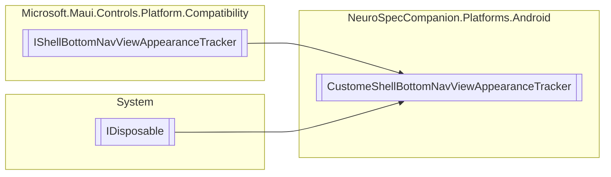

# CustomeShellBottomNavViewAppearanceTracker `Public class`

## Diagram


## Members
### Methods
#### Public  methods
| Returns | Name |
| --- | --- |
| `void` | [`Dispose`](#dispose)() |
| `void` | [`ResetAppearance`](#resetappearance)(`BottomNavigationView` bottomView) |
| `void` | [`SetAppearance`](#setappearance)(`BottomNavigationView` bottomView, `IShellAppearanceElement` appearance) |

## Details
### Inheritance
 - `IShellBottomNavViewAppearanceTracker`
 - `IDisposable`

### Constructors
#### CustomeShellBottomNavViewAppearanceTracker
```csharp
public CustomeShellBottomNavViewAppearanceTracker()
```

### Methods
#### Dispose
[*Source code*](https://github.com///blob//NeuroSpecCompanion/Platforms/Android/CustomShellRender.cs#L29)
```csharp
public virtual void Dispose()
```

#### ResetAppearance
[*Source code*](https://github.com///blob//NeuroSpecCompanion/Platforms/Android/CustomShellRender.cs#L34)
```csharp
public virtual void ResetAppearance(BottomNavigationView bottomView)
```
##### Arguments
| Type | Name | Description |
| --- | --- | --- |
| `BottomNavigationView` | bottomView |   |

#### SetAppearance
[*Source code*](https://github.com///blob//NeuroSpecCompanion/Platforms/Android/CustomShellRender.cs#L39)
```csharp
public virtual void SetAppearance(BottomNavigationView bottomView, IShellAppearanceElement appearance)
```
##### Arguments
| Type | Name | Description |
| --- | --- | --- |
| `BottomNavigationView` | bottomView |   |
| `IShellAppearanceElement` | appearance |   |

*Generated with* [*ModularDoc*](https://github.com/hailstorm75/ModularDoc)
