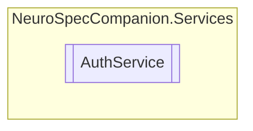

# AuthService `Public class`

## Diagram


## Members
### Methods
#### Public  methods
| Returns | Name |
| --- | --- |
| `Task`&lt;`bool`&gt; | [`AutoLoginAsync`](#autologinasync)() |
| `Task`&lt;[`Patient`](../../neurospec/shared/models/dto/Patient.md)&gt; | [`GetPatientByIdAsync`](#getpatientbyidasync)(`int` patientID) |
| `Task`&lt;`bool`&gt; | [`VerifyPatientCallerAsync`](#verifypatientcallerasync)(`int` patientID, `string` password, `bool` autoLogin) |

## Details
### Constructors
#### AuthService
[*Source code*](https://github.com///blob//NeuroSpecCompanion/Services/AuthService.cs#L18)
```csharp
public AuthService()
```

### Methods
#### GetPatientByIdAsync
```csharp
public async Task<Patient> GetPatientByIdAsync(int patientID)
```
##### Arguments
| Type | Name | Description |
| --- | --- | --- |
| `int` | patientID |   |

#### VerifyPatientCallerAsync
```csharp
public async Task<bool> VerifyPatientCallerAsync(int patientID, string password, bool autoLogin)
```
##### Arguments
| Type | Name | Description |
| --- | --- | --- |
| `int` | patientID |   |
| `string` | password |   |
| `bool` | autoLogin |   |

#### AutoLoginAsync
```csharp
public async Task<bool> AutoLoginAsync()
```

*Generated with* [*ModularDoc*](https://github.com/hailstorm75/ModularDoc)
