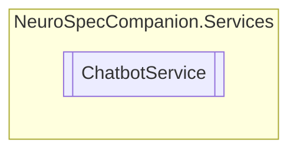

# ChatbotService `Public class`

## Diagram


## Members
### Methods
#### Public  methods
| Returns | Name |
| --- | --- |
| `Task`&lt;`string`&gt; | [`ProcessMessageAsync`](#processmessageasync)(`string` text) |

## Details
### Constructors
#### ChatbotService
[*Source code*](https://github.com///blob//NeuroSpecCompanion/Services/ChatbotService.cs#L13)
```csharp
public ChatbotService()
```

### Methods
#### ProcessMessageAsync
```csharp
public async Task<string> ProcessMessageAsync(string text)
```
##### Arguments
| Type | Name | Description |
| --- | --- | --- |
| `string` | text |   |

*Generated with* [*ModularDoc*](https://github.com/hailstorm75/ModularDoc)
