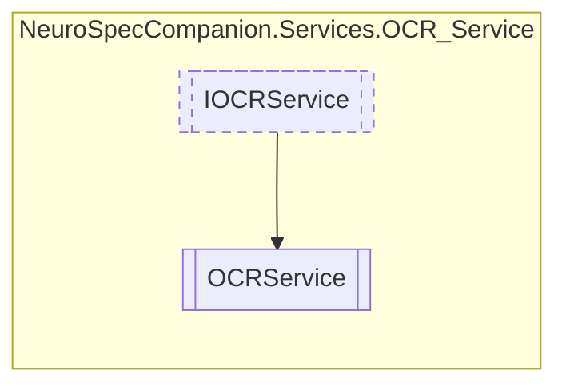

# OCRService `Public class`

## Diagram


## Members
### Methods
#### Public  methods
| Returns | Name |
| --- | --- |
| `Task`&lt;`string`&gt; | [`ReadTextFromImageAsync`](#readtextfromimageasync)(`Stream` imageStream) |

## Details
### Inheritance
 - [
`IOCRService`
](./IOCRService.md)

### Constructors
#### OCRService
```csharp
public OCRService()
```

### Methods
#### ReadTextFromImageAsync
```csharp
public virtual async Task<string> ReadTextFromImageAsync(Stream imageStream)
```
##### Arguments
| Type | Name | Description |
| --- | --- | --- |
| `Stream` | imageStream |   |

*Generated with* [*ModularDoc*](https://github.com/hailstorm75/ModularDoc)
