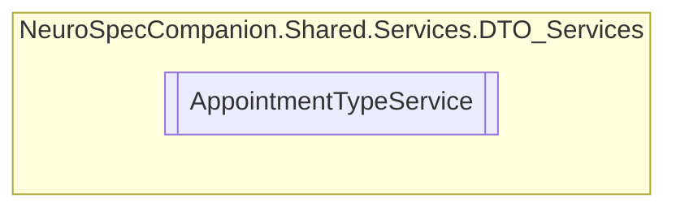

# AppointmentTypeService `Public class`

## Diagram


## Members
### Methods
#### Public  methods
| Returns | Name |
| --- | --- |
| `Task` | [`DeleteAppointmentTypeAsync`](#deleteappointmenttypeasync)(`int` id) |
| `Task`&lt;`IEnumerable`&lt;[`AppointmentType`](../../../../neurospec/shared/models/dto/AppointmentType.md)&gt;&gt; | [`GetAllAppointmentTypesAsync`](#getallappointmenttypesasync)() |
| `Task`&lt;[`AppointmentType`](../../../../neurospec/shared/models/dto/AppointmentType.md)&gt; | [`GetAppointmentTypeByIDAsync`](#getappointmenttypebyidasync)(`int` id) |
| `Task`&lt;[`AppointmentType`](../../../../neurospec/shared/models/dto/AppointmentType.md)&gt; | [`InsertAppointmentTypeAsync`](#insertappointmenttypeasync)([`AppointmentType`](../../../../neurospec/shared/models/dto/AppointmentType.md) appointmentType) |
| `Task` | [`UpdateAppointmentTypeAsync`](#updateappointmenttypeasync)(`int` id, [`AppointmentType`](../../../../neurospec/shared/models/dto/AppointmentType.md) appointmentType) |

## Details
### Constructors
#### AppointmentTypeService
[*Source code*](https://github.com///blob//NeuroSpec.Shared/Services/DTO_Services/AppointmentTypeService.cs#L16)
```csharp
public AppointmentTypeService()
```

### Methods
#### GetAllAppointmentTypesAsync
```csharp
public async Task<IEnumerable<AppointmentType>> GetAllAppointmentTypesAsync()
```

#### GetAppointmentTypeByIDAsync
```csharp
public async Task<AppointmentType> GetAppointmentTypeByIDAsync(int id)
```
##### Arguments
| Type | Name | Description |
| --- | --- | --- |
| `int` | id |   |

#### InsertAppointmentTypeAsync
```csharp
public async Task<AppointmentType> InsertAppointmentTypeAsync(AppointmentType appointmentType)
```
##### Arguments
| Type | Name | Description |
| --- | --- | --- |
| [`AppointmentType`](../../../../neurospec/shared/models/dto/AppointmentType.md) | appointmentType |   |

#### UpdateAppointmentTypeAsync
```csharp
public async Task UpdateAppointmentTypeAsync(int id, AppointmentType appointmentType)
```
##### Arguments
| Type | Name | Description |
| --- | --- | --- |
| `int` | id |   |
| [`AppointmentType`](../../../../neurospec/shared/models/dto/AppointmentType.md) | appointmentType |   |

#### DeleteAppointmentTypeAsync
```csharp
public async Task DeleteAppointmentTypeAsync(int id)
```
##### Arguments
| Type | Name | Description |
| --- | --- | --- |
| `int` | id |   |

*Generated with* [*ModularDoc*](https://github.com/hailstorm75/ModularDoc)
