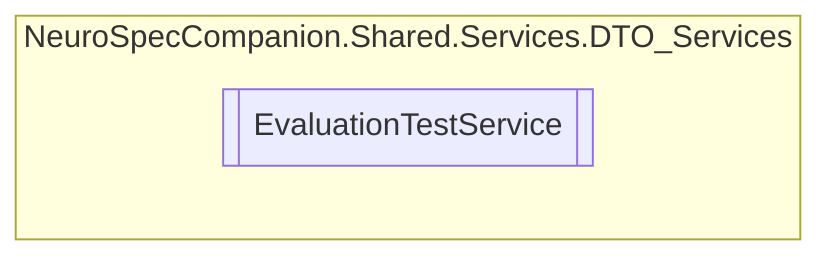

# EvaluationTestService `Public class`

## Diagram


## Members
### Methods
#### Public  methods
| Returns | Name |
| --- | --- |
| `Task` | [`DeleteTestAsync`](#deletetestasync)(`int` testId) |
| `Task`&lt;`IEnumerable`&lt;[`EvaluationTest`](../../../../neurospec/shared/models/dto/EvaluationTest.md)&gt;&gt; | [`GetAllTestsAsync`](#getalltestsasync)() |
| `Task`&lt;[`EvaluationTest`](../../../../neurospec/shared/models/dto/EvaluationTest.md)&gt; | [`GetTestByIdAsync`](#gettestbyidasync)(`int` testId) |
| `Task`&lt;[`EvaluationTest`](../../../../neurospec/shared/models/dto/EvaluationTest.md)&gt; | [`InsertTestAsync`](#inserttestasync)([`EvaluationTest`](../../../../neurospec/shared/models/dto/EvaluationTest.md) test) |
| `Task` | [`UpdateTestAsync`](#updatetestasync)(`int` testId, [`EvaluationTest`](../../../../neurospec/shared/models/dto/EvaluationTest.md) test) |

## Details
### Constructors
#### EvaluationTestService
[*Source code*](https://github.com///blob//NeuroSpec.Shared/Services/DTO_Services/EvaluationTestService.cs#L16)
```csharp
public EvaluationTestService()
```

### Methods
#### GetAllTestsAsync
```csharp
public async Task<IEnumerable<EvaluationTest>> GetAllTestsAsync()
```

#### GetTestByIdAsync
```csharp
public async Task<EvaluationTest> GetTestByIdAsync(int testId)
```
##### Arguments
| Type | Name | Description |
| --- | --- | --- |
| `int` | testId |   |

#### InsertTestAsync
```csharp
public async Task<EvaluationTest> InsertTestAsync(EvaluationTest test)
```
##### Arguments
| Type | Name | Description |
| --- | --- | --- |
| [`EvaluationTest`](../../../../neurospec/shared/models/dto/EvaluationTest.md) | test |   |

#### UpdateTestAsync
```csharp
public async Task UpdateTestAsync(int testId, EvaluationTest test)
```
##### Arguments
| Type | Name | Description |
| --- | --- | --- |
| `int` | testId |   |
| [`EvaluationTest`](../../../../neurospec/shared/models/dto/EvaluationTest.md) | test |   |

#### DeleteTestAsync
```csharp
public async Task DeleteTestAsync(int testId)
```
##### Arguments
| Type | Name | Description |
| --- | --- | --- |
| `int` | testId |   |

*Generated with* [*ModularDoc*](https://github.com/hailstorm75/ModularDoc)
