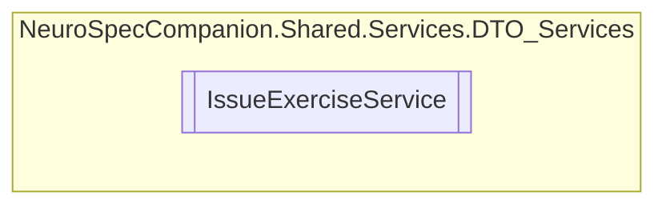

# IssueExerciseService `Public class`

## Diagram


## Members
### Methods
#### Public  methods
| Returns | Name |
| --- | --- |
| `Task` | [`DeleteIssueExerciseAsync`](#deleteissueexerciseasync)(`int` issueID) |
| `Task`&lt;`IEnumerable`&lt;[`IssueExercise`](../../../../neurospec/shared/models/dto/IssueExercise.md)&gt;&gt; | [`GetAllIssueExercisesAsync`](#getallissueexercisesasync)() |
| `Task`&lt;`IEnumerable`&lt;[`IssueExercise`](../../../../neurospec/shared/models/dto/IssueExercise.md)&gt;&gt; | [`GetAllIssueExercisesByPatientIDAsync`](#getallissueexercisesbypatientidasync)(`int` patientID) |
| `Task`&lt;`IEnumerable`&lt;[`IssueExercise`](../../../../neurospec/shared/models/dto/IssueExercise.md)&gt;&gt; | [`GetAllIssueExercisesByPrescriptionIDAsync`](#getallissueexercisesbyprescriptionidasync)(`int` prescriptionID) |
| `Task`&lt;[`IssueExercise`](../../../../neurospec/shared/models/dto/IssueExercise.md)&gt; | [`GetIssueExerciseByIdAsync`](#getissueexercisebyidasync)(`int` issueID) |
| `Task`&lt;[`IssueExercise`](../../../../neurospec/shared/models/dto/IssueExercise.md)&gt; | [`InsertIssueExerciseAsync`](#insertissueexerciseasync)([`IssueExercise`](../../../../neurospec/shared/models/dto/IssueExercise.md) IssueExercise) |
| `Task` | [`UpdateIssueExerciseAsync`](#updateissueexerciseasync)(`int` issueID, [`IssueExercise`](../../../../neurospec/shared/models/dto/IssueExercise.md) IssueExercise) |

## Details
### Constructors
#### IssueExerciseService
[*Source code*](https://github.com///blob//NeuroSpec.Shared/Services/DTO_Services/IssueExerciseService.cs#L15)
```csharp
public IssueExerciseService()
```

### Methods
#### GetAllIssueExercisesAsync
```csharp
public async Task<IEnumerable<IssueExercise>> GetAllIssueExercisesAsync()
```

#### GetIssueExerciseByIdAsync
```csharp
public async Task<IssueExercise> GetIssueExerciseByIdAsync(int issueID)
```
##### Arguments
| Type | Name | Description |
| --- | --- | --- |
| `int` | issueID |   |

#### GetAllIssueExercisesByPatientIDAsync
```csharp
public async Task<IEnumerable<IssueExercise>> GetAllIssueExercisesByPatientIDAsync(int patientID)
```
##### Arguments
| Type | Name | Description |
| --- | --- | --- |
| `int` | patientID |   |

#### GetAllIssueExercisesByPrescriptionIDAsync
```csharp
public async Task<IEnumerable<IssueExercise>> GetAllIssueExercisesByPrescriptionIDAsync(int prescriptionID)
```
##### Arguments
| Type | Name | Description |
| --- | --- | --- |
| `int` | prescriptionID |   |

#### InsertIssueExerciseAsync
```csharp
public async Task<IssueExercise> InsertIssueExerciseAsync(IssueExercise IssueExercise)
```
##### Arguments
| Type | Name | Description |
| --- | --- | --- |
| [`IssueExercise`](../../../../neurospec/shared/models/dto/IssueExercise.md) | IssueExercise |   |

#### UpdateIssueExerciseAsync
```csharp
public async Task UpdateIssueExerciseAsync(int issueID, IssueExercise IssueExercise)
```
##### Arguments
| Type | Name | Description |
| --- | --- | --- |
| `int` | issueID |   |
| [`IssueExercise`](../../../../neurospec/shared/models/dto/IssueExercise.md) | IssueExercise |   |

#### DeleteIssueExerciseAsync
```csharp
public async Task DeleteIssueExerciseAsync(int issueID)
```
##### Arguments
| Type | Name | Description |
| --- | --- | --- |
| `int` | issueID |   |

*Generated with* [*ModularDoc*](https://github.com/hailstorm75/ModularDoc)
