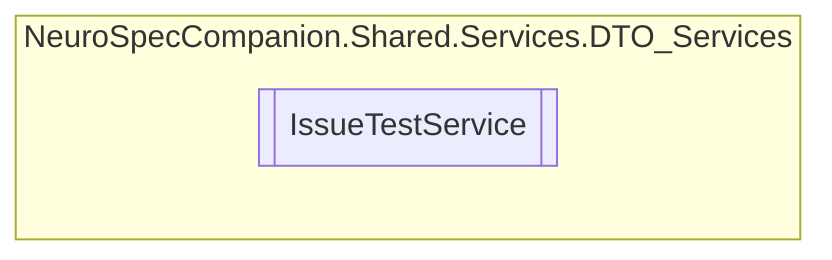

# IssueTestService `Public class`

## Diagram


## Members
### Methods
#### Public  methods
| Returns | Name |
| --- | --- |
| `Task` | [`DeleteIssueTestAsync`](#deleteissuetestasync)(`int` issueID) |
| `Task`&lt;`IEnumerable`&lt;[`IssueTest`](../../../../neurospec/shared/models/dto/IssueTest.md)&gt;&gt; | [`GetAllIssueTestsAsync`](#getallissuetestsasync)() |
| `Task`&lt;`IEnumerable`&lt;[`IssueTest`](../../../../neurospec/shared/models/dto/IssueTest.md)&gt;&gt; | [`GetAllIssueTestsByPatientIDAsync`](#getallissuetestsbypatientidasync)(`int` patientID) |
| `Task`&lt;`IEnumerable`&lt;[`IssueTest`](../../../../neurospec/shared/models/dto/IssueTest.md)&gt;&gt; | [`GetAllIssueTestsByPrescriptionIDAsync`](#getallissuetestsbyprescriptionidasync)(`int` prescriptionID) |
| `Task`&lt;[`IssueTest`](../../../../neurospec/shared/models/dto/IssueTest.md)&gt; | [`GetIssueTestByIdAsync`](#getissuetestbyidasync)(`int` issueID) |
| `Task`&lt;[`IssueTest`](../../../../neurospec/shared/models/dto/IssueTest.md)&gt; | [`InsertIssueTestAsync`](#insertissuetestasync)([`IssueTest`](../../../../neurospec/shared/models/dto/IssueTest.md) IssueTest) |
| `Task` | [`UpdateIssueTestAsync`](#updateissuetestasync)(`int` issueID, [`IssueTest`](../../../../neurospec/shared/models/dto/IssueTest.md) IssueTest) |

## Details
### Constructors
#### IssueTestService
[*Source code*](https://github.com///blob//NeuroSpec.Shared/Services/DTO_Services/IssueTestService.cs#L15)
```csharp
public IssueTestService()
```

### Methods
#### GetAllIssueTestsAsync
```csharp
public async Task<IEnumerable<IssueTest>> GetAllIssueTestsAsync()
```

#### GetIssueTestByIdAsync
```csharp
public async Task<IssueTest> GetIssueTestByIdAsync(int issueID)
```
##### Arguments
| Type | Name | Description |
| --- | --- | --- |
| `int` | issueID |   |

#### GetAllIssueTestsByPatientIDAsync
```csharp
public async Task<IEnumerable<IssueTest>> GetAllIssueTestsByPatientIDAsync(int patientID)
```
##### Arguments
| Type | Name | Description |
| --- | --- | --- |
| `int` | patientID |   |

#### GetAllIssueTestsByPrescriptionIDAsync
```csharp
public async Task<IEnumerable<IssueTest>> GetAllIssueTestsByPrescriptionIDAsync(int prescriptionID)
```
##### Arguments
| Type | Name | Description |
| --- | --- | --- |
| `int` | prescriptionID |   |

#### InsertIssueTestAsync
```csharp
public async Task<IssueTest> InsertIssueTestAsync(IssueTest IssueTest)
```
##### Arguments
| Type | Name | Description |
| --- | --- | --- |
| [`IssueTest`](../../../../neurospec/shared/models/dto/IssueTest.md) | IssueTest |   |

#### UpdateIssueTestAsync
```csharp
public async Task UpdateIssueTestAsync(int issueID, IssueTest IssueTest)
```
##### Arguments
| Type | Name | Description |
| --- | --- | --- |
| `int` | issueID |   |
| [`IssueTest`](../../../../neurospec/shared/models/dto/IssueTest.md) | IssueTest |   |

#### DeleteIssueTestAsync
```csharp
public async Task DeleteIssueTestAsync(int issueID)
```
##### Arguments
| Type | Name | Description |
| --- | --- | --- |
| `int` | issueID |   |

*Generated with* [*ModularDoc*](https://github.com/hailstorm75/ModularDoc)
