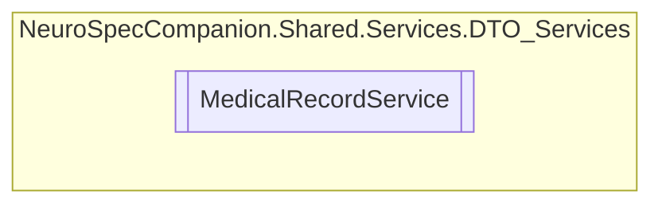

# MedicalRecordService `Public class`

## Diagram


## Members
### Methods
#### Public  methods
| Returns | Name |
| --- | --- |
| `Task`&lt;`IEnumerable`&lt;[`MedicalRecord`](../../../../neurospec/shared/models/dto/MedicalRecord.md)&gt;&gt; | [`GetAllMedicalRecordsAsync`](#getallmedicalrecordsasync)() |
| `Task`&lt;`IEnumerable`&lt;[`MedicalRecord`](../../../../neurospec/shared/models/dto/MedicalRecord.md)&gt;&gt; | [`GetAllPatientRecordsAsync`](#getallpatientrecordsasync)(`int` patientID) |
| `Task`&lt;[`MedicalRecord`](../../../../neurospec/shared/models/dto/MedicalRecord.md)&gt; | [`GetMedicalRecordByIDAsync`](#getmedicalrecordbyidasync)(`int` recordID) |
| `Task`&lt;`DiagnosticReport`&gt; | [`GetMedicalRecordOnFHIRByIDAsync`](#getmedicalrecordonfhirbyidasync)(`int` recordID) |
| `Task`&lt;[`MedicalRecord`](../../../../neurospec/shared/models/dto/MedicalRecord.md)&gt; | [`InsertMedicalRecordAsync`](#insertmedicalrecordasync)([`MedicalRecord`](../../../../neurospec/shared/models/dto/MedicalRecord.md) medicalRecord) |

## Details
### Constructors
#### MedicalRecordService
[*Source code*](https://github.com///blob//NeuroSpec.Shared/Services/DTO_Services/MedicalRecordService.cs#L17)
```csharp
public MedicalRecordService()
```

### Methods
#### GetAllMedicalRecordsAsync
```csharp
public async Task<IEnumerable<MedicalRecord>> GetAllMedicalRecordsAsync()
```

#### GetMedicalRecordByIDAsync
```csharp
public async Task<MedicalRecord> GetMedicalRecordByIDAsync(int recordID)
```
##### Arguments
| Type | Name | Description |
| --- | --- | --- |
| `int` | recordID |   |

#### GetMedicalRecordOnFHIRByIDAsync
```csharp
public async Task<DiagnosticReport> GetMedicalRecordOnFHIRByIDAsync(int recordID)
```
##### Arguments
| Type | Name | Description |
| --- | --- | --- |
| `int` | recordID |   |

#### GetAllPatientRecordsAsync
```csharp
public async Task<IEnumerable<MedicalRecord>> GetAllPatientRecordsAsync(int patientID)
```
##### Arguments
| Type | Name | Description |
| --- | --- | --- |
| `int` | patientID |   |

#### InsertMedicalRecordAsync
```csharp
public async Task<MedicalRecord> InsertMedicalRecordAsync(MedicalRecord medicalRecord)
```
##### Arguments
| Type | Name | Description |
| --- | --- | --- |
| [`MedicalRecord`](../../../../neurospec/shared/models/dto/MedicalRecord.md) | medicalRecord |   |

*Generated with* [*ModularDoc*](https://github.com/hailstorm75/ModularDoc)
