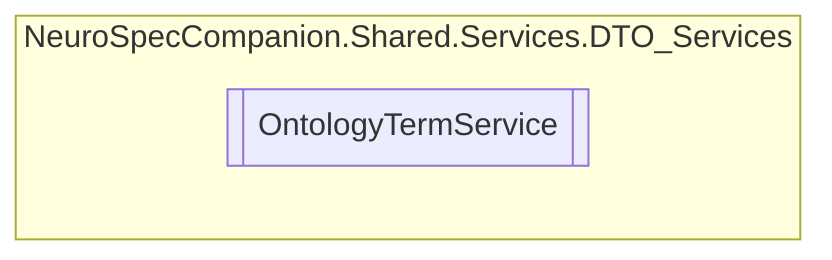

# OntologyTermService `Public class`

## Diagram


## Members
### Methods
#### Public  methods
| Returns | Name |
| --- | --- |
| `Task` | [`DeleteOntologyTermAsync`](#deleteontologytermasync)(`string` id) |
| `Task`&lt;[`OntologyTerm`](../../../../neurospec/shared/models/dto/OntologyTerm.md)&gt; | [`GetOntologyTermByIdAsync`](#getontologytermbyidasync)(`string` id) |
| `Task`&lt;[`OntologyTerm`](../../../../neurospec/shared/models/dto/OntologyTerm.md)&gt; | [`InsertOntologyTermAsync`](#insertontologytermasync)([`OntologyTerm`](../../../../neurospec/shared/models/dto/OntologyTerm.md) ontologyTerm) |
| `Task` | [`UpdateOntologyTermAsync`](#updateontologytermasync)(`string` id, [`OntologyTerm`](../../../../neurospec/shared/models/dto/OntologyTerm.md) ontologyTerm) |

## Details
### Constructors
#### OntologyTermService
[*Source code*](https://github.com///blob//NeuroSpec.Shared/Services/DTO_Services/OntologyTermService.cs#L16)
```csharp
public OntologyTermService()
```

### Methods
#### GetOntologyTermByIdAsync
```csharp
public async Task<OntologyTerm> GetOntologyTermByIdAsync(string id)
```
##### Arguments
| Type | Name | Description |
| --- | --- | --- |
| `string` | id |   |

#### InsertOntologyTermAsync
```csharp
public async Task<OntologyTerm> InsertOntologyTermAsync(OntologyTerm ontologyTerm)
```
##### Arguments
| Type | Name | Description |
| --- | --- | --- |
| [`OntologyTerm`](../../../../neurospec/shared/models/dto/OntologyTerm.md) | ontologyTerm |   |

#### UpdateOntologyTermAsync
```csharp
public async Task UpdateOntologyTermAsync(string id, OntologyTerm ontologyTerm)
```
##### Arguments
| Type | Name | Description |
| --- | --- | --- |
| `string` | id |   |
| [`OntologyTerm`](../../../../neurospec/shared/models/dto/OntologyTerm.md) | ontologyTerm |   |

#### DeleteOntologyTermAsync
```csharp
public async Task DeleteOntologyTermAsync(string id)
```
##### Arguments
| Type | Name | Description |
| --- | --- | --- |
| `string` | id |   |

*Generated with* [*ModularDoc*](https://github.com/hailstorm75/ModularDoc)
