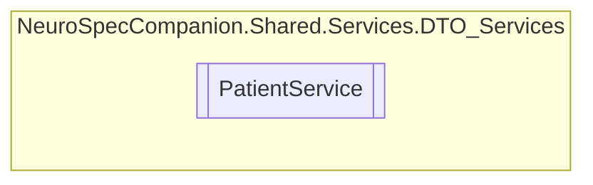

# PatientService `Public class`

## Diagram


## Members
### Methods
#### Public  methods
| Returns | Name |
| --- | --- |
| `Task`&lt;`IEnumerable`&lt;[`Patient`](../../../../neurospec/shared/models/dto/Patient.md)&gt;&gt; | [`GetAllPatientsAsync`](#getallpatientsasync)() |
| `Task`&lt;`Patient`&gt; | [`GetFHIRPatientByIdAsync`](#getfhirpatientbyidasync)(`int` patientID) |
| `Task`&lt;[`Patient`](../../../../neurospec/shared/models/dto/Patient.md)&gt; | [`GetPatientByIdAsync`](#getpatientbyidasync)(`int` patientID) |
| `Task`&lt;[`Patient`](../../../../neurospec/shared/models/dto/Patient.md)&gt; | [`InsertPatientAsync`](#insertpatientasync)([`Patient`](../../../../neurospec/shared/models/dto/Patient.md) patient) |
| `Task`&lt;`bool`&gt; | [`VerifyPatientAsync`](#verifypatientasync)(`int` patientID, `string` password) |

## Details
### Constructors
#### PatientService
[*Source code*](https://github.com///blob//NeuroSpec.Shared/Services/DTO_Services/PatientService.cs#L16)
```csharp
public PatientService()
```

### Methods
#### GetAllPatientsAsync
```csharp
public async Task<IEnumerable<Patient>> GetAllPatientsAsync()
```

#### GetPatientByIdAsync
```csharp
public async Task<Patient> GetPatientByIdAsync(int patientID)
```
##### Arguments
| Type | Name | Description |
| --- | --- | --- |
| `int` | patientID |   |

#### GetFHIRPatientByIdAsync
```csharp
public async Task<Patient> GetFHIRPatientByIdAsync(int patientID)
```
##### Arguments
| Type | Name | Description |
| --- | --- | --- |
| `int` | patientID |   |

#### VerifyPatientAsync
```csharp
public async Task<bool> VerifyPatientAsync(int patientID, string password)
```
##### Arguments
| Type | Name | Description |
| --- | --- | --- |
| `int` | patientID |   |
| `string` | password |   |

#### InsertPatientAsync
```csharp
public async Task<Patient> InsertPatientAsync(Patient patient)
```
##### Arguments
| Type | Name | Description |
| --- | --- | --- |
| [`Patient`](../../../../neurospec/shared/models/dto/Patient.md) | patient |   |

*Generated with* [*ModularDoc*](https://github.com/hailstorm75/ModularDoc)
