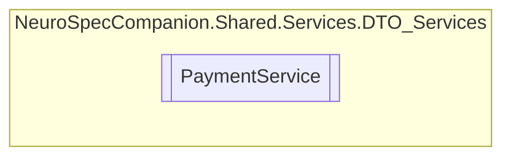

# PaymentService `Public class`

## Diagram


## Members
### Methods
#### Public  methods
| Returns | Name |
| --- | --- |
| `Task` | [`DeletePaymentAsync`](#deletepaymentasync)(`int` paymentID) |
| `Task`&lt;`IEnumerable`&lt;[`Payment`](../../../../neurospec/shared/models/dto/Payment.md)&gt;&gt; | [`GetAllPaymentsAsync`](#getallpaymentsasync)() |
| `Task`&lt;`IEnumerable`&lt;[`Payment`](../../../../neurospec/shared/models/dto/Payment.md)&gt;&gt; | [`GetDoctorPaymentsAsync`](#getdoctorpaymentsasync)(`int` doctorID) |
| `Task`&lt;`IEnumerable`&lt;[`Payment`](../../../../neurospec/shared/models/dto/Payment.md)&gt;&gt; | [`GetPatientPaymentsAsync`](#getpatientpaymentsasync)(`int` patientID) |
| `Task`&lt;[`Payment`](../../../../neurospec/shared/models/dto/Payment.md)&gt; | [`GetPaymentByIDAsync`](#getpaymentbyidasync)(`int` paymentID) |
| `Task`&lt;[`Payment`](../../../../neurospec/shared/models/dto/Payment.md)&gt; | [`InsertPaymentAsync`](#insertpaymentasync)([`Payment`](../../../../neurospec/shared/models/dto/Payment.md) payment) |
| `Task` | [`UpdatePaymentAsync`](#updatepaymentasync)(`int` paymentID, [`Payment`](../../../../neurospec/shared/models/dto/Payment.md) payment) |

## Details
### Constructors
#### PaymentService
[*Source code*](https://github.com///blob//NeuroSpec.Shared/Services/DTO_Services/PaymentService.cs#L16)
```csharp
public PaymentService()
```

### Methods
#### GetAllPaymentsAsync
```csharp
public async Task<IEnumerable<Payment>> GetAllPaymentsAsync()
```

#### GetPaymentByIDAsync
```csharp
public async Task<Payment> GetPaymentByIDAsync(int paymentID)
```
##### Arguments
| Type | Name | Description |
| --- | --- | --- |
| `int` | paymentID |   |

#### GetPatientPaymentsAsync
```csharp
public async Task<IEnumerable<Payment>> GetPatientPaymentsAsync(int patientID)
```
##### Arguments
| Type | Name | Description |
| --- | --- | --- |
| `int` | patientID |   |

#### GetDoctorPaymentsAsync
```csharp
public async Task<IEnumerable<Payment>> GetDoctorPaymentsAsync(int doctorID)
```
##### Arguments
| Type | Name | Description |
| --- | --- | --- |
| `int` | doctorID |   |

#### InsertPaymentAsync
```csharp
public async Task<Payment> InsertPaymentAsync(Payment payment)
```
##### Arguments
| Type | Name | Description |
| --- | --- | --- |
| [`Payment`](../../../../neurospec/shared/models/dto/Payment.md) | payment |   |

#### UpdatePaymentAsync
```csharp
public async Task UpdatePaymentAsync(int paymentID, Payment payment)
```
##### Arguments
| Type | Name | Description |
| --- | --- | --- |
| `int` | paymentID |   |
| [`Payment`](../../../../neurospec/shared/models/dto/Payment.md) | payment |   |

#### DeletePaymentAsync
```csharp
public async Task DeletePaymentAsync(int paymentID)
```
##### Arguments
| Type | Name | Description |
| --- | --- | --- |
| `int` | paymentID |   |

*Generated with* [*ModularDoc*](https://github.com/hailstorm75/ModularDoc)
