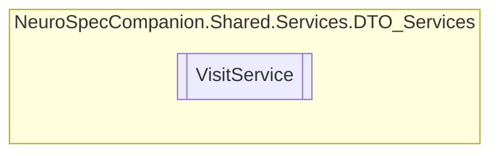

# VisitService `Public class`

## Diagram


## Members
### Methods
#### Public  methods
| Returns | Name |
| --- | --- |
| `Task` | [`DeleteVisitAsync`](#deletevisitasync)(`int` visitID) |
| `Task`&lt;`IEnumerable`&lt;[`Visit`](../../../../neurospec/shared/models/dto/Visit.md)&gt;&gt; | [`GetAllVisitsAsync`](#getallvisitsasync)() |
| `Task`&lt;`List`&lt;`string`&gt;&gt; | [`GetAvailableTimeSlotsOnDayAsync`](#getavailabletimeslotsondayasync)(`DateTime` selectedDay, `int` DoctorID) |
| `Task`&lt;[`Visit`](../../../../neurospec/shared/models/dto/Visit.md)&gt; | [`GetVisitByIDAsync`](#getvisitbyidasync)(`int` visitID) |
| `Task`&lt;`List`&lt;[`Visit`](../../../../neurospec/shared/models/dto/Visit.md)&gt;&gt; | [`GetVisitsByPatientIDAsync`](#getvisitsbypatientidasync)(`int` patientID) |
| `Task`&lt;[`Visit`](../../../../neurospec/shared/models/dto/Visit.md)&gt; | [`InsertVisitAsync`](#insertvisitasync)([`Visit`](../../../../neurospec/shared/models/dto/Visit.md) visit) |
| `Task` | [`UpdateVisitAsync`](#updatevisitasync)(`int` visitID, [`Visit`](../../../../neurospec/shared/models/dto/Visit.md) visit) |

## Details
### Constructors
#### VisitService
[*Source code*](https://github.com///blob//NeuroSpec.Shared/Services/DTO_Services/VisitService.cs#L16)
```csharp
public VisitService()
```

### Methods
#### GetAllVisitsAsync
```csharp
public async Task<IEnumerable<Visit>> GetAllVisitsAsync()
```

#### GetVisitByIDAsync
```csharp
public async Task<Visit> GetVisitByIDAsync(int visitID)
```
##### Arguments
| Type | Name | Description |
| --- | --- | --- |
| `int` | visitID |   |

#### GetVisitsByPatientIDAsync
```csharp
public async Task<List<Visit>> GetVisitsByPatientIDAsync(int patientID)
```
##### Arguments
| Type | Name | Description |
| --- | --- | --- |
| `int` | patientID |   |

#### InsertVisitAsync
```csharp
public async Task<Visit> InsertVisitAsync(Visit visit)
```
##### Arguments
| Type | Name | Description |
| --- | --- | --- |
| [`Visit`](../../../../neurospec/shared/models/dto/Visit.md) | visit |   |

#### UpdateVisitAsync
```csharp
public async Task UpdateVisitAsync(int visitID, Visit visit)
```
##### Arguments
| Type | Name | Description |
| --- | --- | --- |
| `int` | visitID |   |
| [`Visit`](../../../../neurospec/shared/models/dto/Visit.md) | visit |   |

#### DeleteVisitAsync
```csharp
public async Task DeleteVisitAsync(int visitID)
```
##### Arguments
| Type | Name | Description |
| --- | --- | --- |
| `int` | visitID |   |

#### GetAvailableTimeSlotsOnDayAsync
```csharp
public async Task<List<string>> GetAvailableTimeSlotsOnDayAsync(DateTime selectedDay, int DoctorID)
```
##### Arguments
| Type | Name | Description |
| --- | --- | --- |
| `DateTime` | selectedDay |   |
| `int` | DoctorID |   |

*Generated with* [*ModularDoc*](https://github.com/hailstorm75/ModularDoc)
