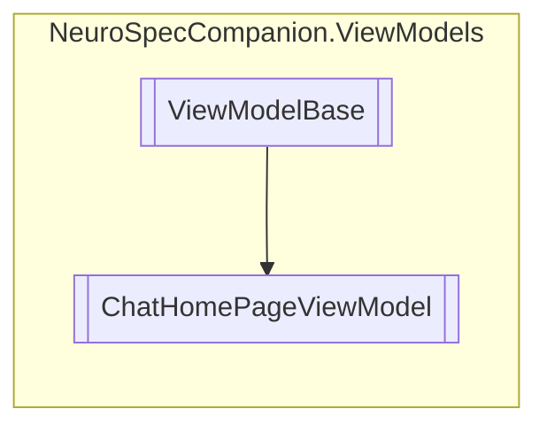

# ChatHomePageViewModel `Public class`

## Diagram


## Details
### Inheritance
 - [
`ViewModelBase`
](./ViewModelBase.md)

### Constructors
#### ChatHomePageViewModel
[*Source code*](https://github.com///blob//NeuroSpecCompanion/ViewModels/ChatHomePageViewModel.cs#L11)
```csharp
public ChatHomePageViewModel()
```

*Generated with* [*ModularDoc*](https://github.com/hailstorm75/ModularDoc)
