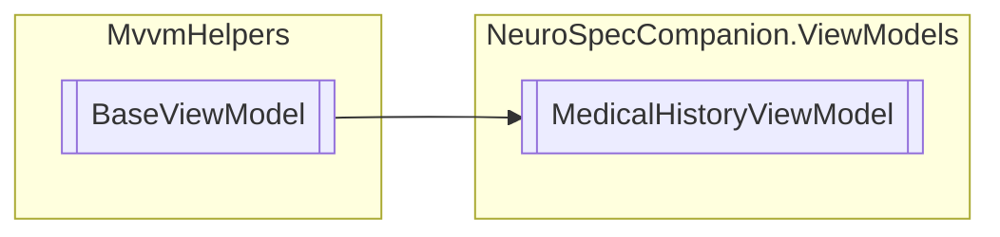

# MedicalHistoryViewModel `Public class`

## Diagram


## Members
### Properties
#### Public  properties
| Type | Name | Methods |
| --- | --- | --- |
| `ICommand` | [`DeleteCommand`](#deletecommand) | `get` |
| `ObservableCollection`&lt;[`MedicalRecord`](../../neurospec/shared/models/dto/MedicalRecord.md)&gt; | [`MedicalRecords`](#medicalrecords) | `get` |
| `ICommand` | [`UploadFileCommand`](#uploadfilecommand) | `get` |
| `ICommand` | [`ViewRecordCommand`](#viewrecordcommand) | `get` |

## Details
### Inheritance
 - `BaseViewModel`

### Constructors
#### MedicalHistoryViewModel
[*Source code*](https://github.com///blob//NeuroSpecCompanion/ViewModels/MedicalHistoryViewModel.cs#L24)
```csharp
public MedicalHistoryViewModel()
```

### Properties
#### MedicalRecords
```csharp
public ObservableCollection<MedicalRecord> MedicalRecords { get; }
```

#### UploadFileCommand
```csharp
public ICommand UploadFileCommand { get; }
```

#### DeleteCommand
```csharp
public ICommand DeleteCommand { get; }
```

#### ViewRecordCommand
```csharp
public ICommand ViewRecordCommand { get; }
```

*Generated with* [*ModularDoc*](https://github.com/hailstorm75/ModularDoc)
