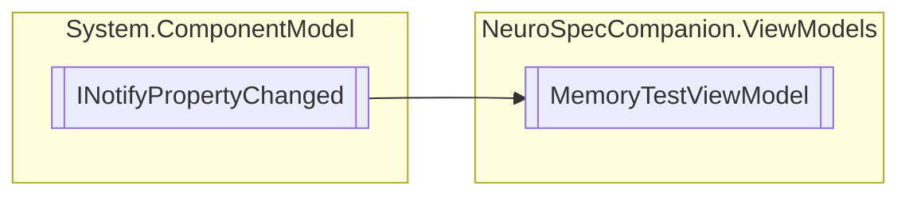

# MemoryTestViewModel `Internal class`

## Diagram


## Details
### Inheritance
 - `INotifyPropertyChanged`

### Constructors
#### MemoryTestViewModel
[*Source code*](https://github.com///blob//NeuroSpecCompanion/ViewModels/MemoryTestViewModel.cs#L15)
```csharp
public MemoryTestViewModel()
```

### Events
#### PropertyChanged
```csharp
public event PropertyChangedEventHandler PropertyChanged
```

*Generated with* [*ModularDoc*](https://github.com/hailstorm75/ModularDoc)
