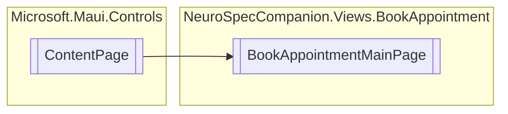

# BookAppointmentMainPage `Public class`

## Diagram


## Details
### Inheritance
 - `ContentPage`

### Constructors
#### BookAppointmentMainPage
[*Source code*](https://github.com///blob//NeuroSpecCompanion/Views/BookAppointment/BookAppointmentMainPage.xaml.cs#L7)
```csharp
public BookAppointmentMainPage()
```

*Generated with* [*ModularDoc*](https://github.com/hailstorm75/ModularDoc)
