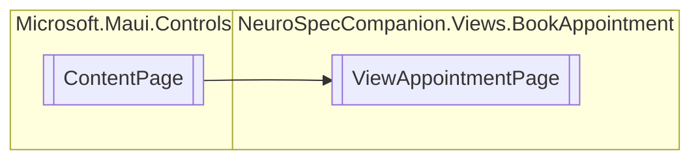

# ViewAppointmentPage `Public class`

## Diagram


## Members
### Properties
#### Public  properties
| Type | Name | Methods |
| --- | --- | --- |
| [`Visit`](../../../neurospec/shared/models/dto/Visit.md) | [`Visit`](#visit) | `get, set` |

### Methods
#### Protected  methods
| Returns | Name |
| --- | --- |
| `void` | [`OnAppearing`](#onappearing)() |

## Details
### Inheritance
 - `ContentPage`

### Constructors
#### ViewAppointmentPage
[*Source code*](https://github.com///blob//NeuroSpecCompanion/Views/BookAppointment/ViewAppointmentPage.xaml.cs#L10)
```csharp
public ViewAppointmentPage()
```

### Methods
#### OnAppearing
[*Source code*](https://github.com///blob//NeuroSpecCompanion/Views/BookAppointment/ViewAppointmentPage.xaml.cs#L17)
```csharp
protected override void OnAppearing()
```

### Properties
#### Visit
```csharp
public Visit Visit { get; set; }
```

*Generated with* [*ModularDoc*](https://github.com/hailstorm75/ModularDoc)
