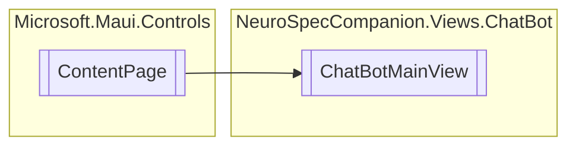

# ChatBotMainView `Public class`

## Diagram


## Members
### Methods
#### Public  methods
| Returns | Name |
| --- | --- |
| `HorizontalStackLayout` | [`CreateNewResponseMessage`](#createnewresponsemessage)(`string` text) |
| `HorizontalStackLayout` | [`CreateNewSenderMessage`](#createnewsendermessage)(`string` text) |

## Details
### Inheritance
 - `ContentPage`

### Constructors
#### ChatBotMainView
[*Source code*](https://github.com///blob//NeuroSpecCompanion/Views/ChatBot/ChatBotMainView.xaml.cs#L96)
```csharp
public ChatBotMainView()
```

### Methods
#### CreateNewSenderMessage
[*Source code*](https://github.com///blob//NeuroSpecCompanion/Views/ChatBot/ChatBotMainView.xaml.cs#L22)
```csharp
public HorizontalStackLayout CreateNewSenderMessage(string text)
```
##### Arguments
| Type | Name | Description |
| --- | --- | --- |
| `string` | text |   |

#### CreateNewResponseMessage
[*Source code*](https://github.com///blob//NeuroSpecCompanion/Views/ChatBot/ChatBotMainView.xaml.cs#L60)
```csharp
public HorizontalStackLayout CreateNewResponseMessage(string text)
```
##### Arguments
| Type | Name | Description |
| --- | --- | --- |
| `string` | text |   |

*Generated with* [*ModularDoc*](https://github.com/hailstorm75/ModularDoc)
