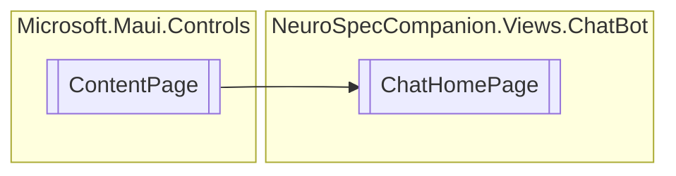

# ChatHomePage `Public class`

## Diagram


## Details
### Inheritance
 - `ContentPage`

### Constructors
#### ChatHomePage
[*Source code*](https://github.com///blob//NeuroSpecCompanion/Views/ChatBot/ChatHomePage.xaml.cs#L5)
```csharp
public ChatHomePage()
```

*Generated with* [*ModularDoc*](https://github.com/hailstorm75/ModularDoc)
