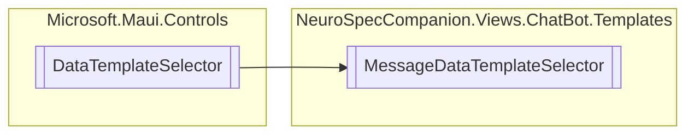

# MessageDataTemplateSelector `Internal class`

## Diagram


## Members
### Properties
#### Public  properties
| Type | Name | Methods |
| --- | --- | --- |
| `DataTemplate` | [`ReceiverMessageTemplate`](#receivermessagetemplate) | `get, set` |
| `DataTemplate` | [`SenderMessageTemplate`](#sendermessagetemplate) | `get, set` |

### Methods
#### Protected  methods
| Returns | Name |
| --- | --- |
| `DataTemplate` | [`OnSelectTemplate`](#onselecttemplate)(`object` item, `BindableObject` container) |

## Details
### Inheritance
 - `DataTemplateSelector`

### Constructors
#### MessageDataTemplateSelector
```csharp
public MessageDataTemplateSelector()
```

### Methods
#### OnSelectTemplate
[*Source code*](https://github.com///blob//NeuroSpecCompanion/Views/ChatBot/Templates/MessageDataTemplateSelector.cs#L16)
```csharp
protected override DataTemplate OnSelectTemplate(object item, BindableObject container)
```
##### Arguments
| Type | Name | Description |
| --- | --- | --- |
| `object` | item |   |
| `BindableObject` | container |   |

### Properties
#### SenderMessageTemplate
```csharp
public DataTemplate SenderMessageTemplate { get; set; }
```

#### ReceiverMessageTemplate
```csharp
public DataTemplate ReceiverMessageTemplate { get; set; }
```

*Generated with* [*ModularDoc*](https://github.com/hailstorm75/ModularDoc)
