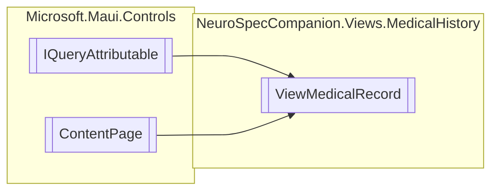

# ViewMedicalRecord `Public class`

## Diagram


## Members
### Methods
#### Public  methods
| Returns | Name |
| --- | --- |
| `void` | [`ApplyQueryAttributes`](#applyqueryattributes)(`IDictionary`&lt;`string`, `object`&gt; query) |

## Details
### Inheritance
 - `IQueryAttributable`
 - `ContentPage`

### Constructors
#### ViewMedicalRecord
[*Source code*](https://github.com///blob//NeuroSpecCompanion/Views/MedicalHistory/ViewMedicalRecord.xaml.cs#L7)
```csharp
public ViewMedicalRecord()
```

### Methods
#### ApplyQueryAttributes
[*Source code*](https://github.com///blob//NeuroSpecCompanion/Views/MedicalHistory/ViewMedicalRecord.xaml.cs#L13)
```csharp
public virtual void ApplyQueryAttributes(IDictionary<string, object> query)
```
##### Arguments
| Type | Name | Description |
| --- | --- | --- |
| `IDictionary`&lt;`string`, `object`&gt; | query |   |

*Generated with* [*ModularDoc*](https://github.com/hailstorm75/ModularDoc)
