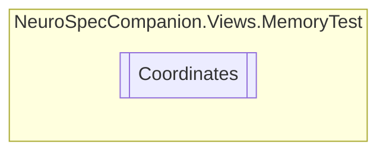

# Coordinates `Internal class`

## Diagram


## Members
### Properties
#### Public  properties
| Type | Name | Methods |
| --- | --- | --- |
| `int` | [`x`](#x) | `get, set` |
| `int` | [`y`](#y) | `get, set` |

## Details
### Constructors
#### Coordinates [1/2]
[*Source code*](https://github.com///blob//NeuroSpecCompanion/Views/MemoryTest/MemoryGame.xaml.cs#L19)
```csharp
public Coordinates()
```

#### Coordinates [2/2]
[*Source code*](https://github.com///blob//NeuroSpecCompanion/Views/MemoryTest/MemoryGame.xaml.cs#L20)
```csharp
public Coordinates(int x, int y)
```
##### Arguments
| Type | Name | Description |
| --- | --- | --- |
| `int` | x |   |
| `int` | y |   |

### Properties
#### x
```csharp
public int x { get; set; }
```

#### y
```csharp
public int y { get; set; }
```

*Generated with* [*ModularDoc*](https://github.com/hailstorm75/ModularDoc)
