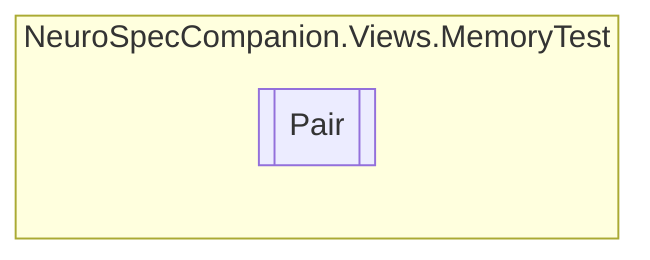

# Pair `Internal class`

## Diagram


## Members
### Properties
#### Public  properties
| Type | Name | Methods |
| --- | --- | --- |
| `int` | [`imageIdx`](#imageidx) | `get, set` |
| `bool` | [`matched`](#matched) | `get, set` |

## Details
### Constructors
#### Pair
[*Source code*](https://github.com///blob//NeuroSpecCompanion/Views/MemoryTest/MemoryGame.xaml.cs#L7)
```csharp
public Pair(int img)
```
##### Arguments
| Type | Name | Description |
| --- | --- | --- |
| `int` | img |   |

### Properties
#### imageIdx
```csharp
public int imageIdx { get; set; }
```

#### matched
```csharp
public bool matched { get; set; }
```

*Generated with* [*ModularDoc*](https://github.com/hailstorm75/ModularDoc)
